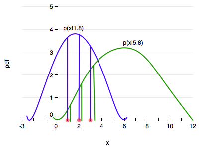
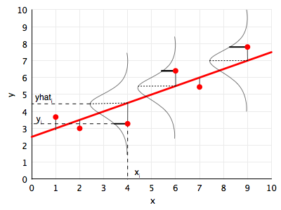
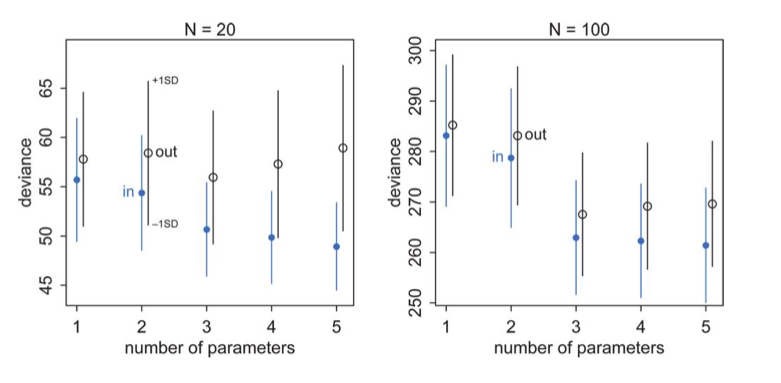
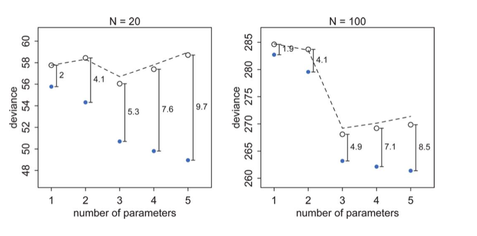

# From the MLE to the AIC

$$ \newcommand{\Ex}{\mathbb{E}} \newcommand{\Var}{\mathrm{Var}} \newcommand{\Cov}{\mathrm{Cov}} \newcommand{\SampleAvg}{\frac{1}{N({S})} \sum_{s \in {S}}} \newcommand{\indic}{\mathbb{1}} \newcommand{\avg}{\overline} \newcommand{\est}{\hat} \newcommand{\trueval}[1]{#1{*}} \newcommand{\Gam}[1]{\mathrm{Gamma}#1} $$

$$ \renewcommand{\like}{\cal L} \renewcommand{\loglike}{\ell} \renewcommand{\err}{\cal E} \renewcommand{\dat}{\cal D} \renewcommand{\hyp}{\cal H} \renewcommand{\Ex}[2]{E_{#1}[#2]} \renewcommand{\x}{\mathbf x} \renewcommand{\v}[1]{\mathbf #1}\renewcommand{\gcald}{g_{\cal D}}\renewcommand{\ecald}{E_{\cal{D}}}$$

## Notation Used

Let us establish some notation here. Your chances of having two practitioners agree on notation is less than your chances of making money when someone sends you an email asking you to deposit their cash.

We will denote the true distribution of data, as seen on an infinitely large population by $p$. The estimate of this distribution on a sample, will be denoted, appropriately for estimates, by $\hat{p}$. Now, if you were not told the true distribution, you might attempt to approximate it within some distribution family like normals. We shall denote this distribution, if you attempted to fit in on the population, $q$. Once again, in real life, you are not given a population, so you attempt to find the distribution on a sample, which we shall denote by $\hat{q}$.

What distributions are we talking about? This is completely general, it could be the distribution of heights and weights in the human population, or a likelihood distribution (see below) for a ordinary linear regression.

Finally we'll denote a true model by the function $f$. This for example could be the probability of voting republican based on your income. It might be a complex function, such as a probit. We'll denote a function (such as a regression function) which you estimate on a sample of your population as $\hat{f}$ or $g$. This could be a polynomial in income, keeping with our example.

Finally, we'll denote the dataset from your sample as ${\cal D}$.

## Choosing a parametric model

When we do data analysis in a parametric way, we start by characterizing our particular sample statistically then, using a *probability distribution* (or mass function). This distribution has some parameters. Lets refer to these as θ.

If we assume that our **data was generated** by this distribution, then the notion of the **true value** of the parameter makes sense. Now, usually in life, there is no way of knowing if this was the true generating process, unless we have some physics or similar ideas behind the process. But lets stick with the *myth* that we can do this. Then let us call the true value of the parameters as $\theta^*$.

To know this true value, we’d typically need the entire large population, not the sample we have been given as data. So the best we can do us to make a parameter estimate $\hat{\theta}$ from the data. In the context of frequentist statistics, the assumption is that the parameters are fixed, and that there is this true value ($\theta^*$), and that we can make some estimate of this from our sample ($\hat{\theta}$).

A distribution is induced on this estimate by considering many samples that could have been drawn from the population…remember that frequentist statistics fixes the parameters but considers data stochastic. This distribution is called the sampling distribution of the parameter θ. (In general a sampling distribution can be considered for anything computed on the sample, such as a mean or variance or other moment).

Our question is: how do we estimate  $\hat{\theta}$. So far we have seen the idea of estimating OLS parameters using the method of least squares, but this seems to be an idea very specific to regression.

This question is tackled by the Maximum Likelihood Estimate, or MLE. 

Lets learn about the MLE in the context of a particular distribution, the exponential.

### The idea behind the MLE

The diagram below illustrates the idea behind the MLE.

Consider two distributions in the same family, one with a parameter, lets call it $\theta$, of value 1.8 (blue) and another of value 5.8. (green). Let's say we have 3 data points, at $x=1,2,3$.

Maximum likelihood starts by asking the question: conditional on the fixed value of $\theta$, which distribution is the data more likely to have come from?

In our case the blue is more likely since the product of the height of the 3 vertical blue bars is higher than that of the 3 green bars.

Indeed the question that MLE asks is: how can we move and scale the distribution, that is, change $\theta$, until the product of the 3 bars is maximised!

That is, the product 
$$
L(\lambda) = \prod_{i=1}^n P(x_i \mid \lambda)
$$
gives us a measure of how likely it is to observe values $x_1,...,x_n$ given the parameters $\lambda$. Maximum likelihood fitting consists of choosing the appropriate "likelihood" function $L=P(X \mid \lambda)$ to maximize for a given set of observations. How likely are the observations if the model is true?

Often it is easier and numerically more stable to maximise the log likelyhood:
$$
\ell(\lambda) = \sum_{i=1}^n ln(P(x_i \mid \lambda))
$$
The exponential distribution occurs naturally when describing the lengths of the inter-arrival times in a homogeneous Poisson process.

It takes the form:
$$
f(x;\lambda) = \begin{cases}
\lambda e^{-\lambda x} & x \ge 0, \\
0 & x < 0.
\end{cases}
$$
In the case of the exponential distribution we have:
$$
\ell(\lambda) = \sum_{i=1}^n ln(\lambda e^{-\lambda x_i}) = \sum_{i=1}^n \left( ln(\lambda) - \lambda x_i \right).
$$
Maximizing this:
$$
\frac{d \ell}{d\lambda} = \frac{n}{\lambda} - \sum_{i=1}^n x_i = 0
$$
and thus:
$$
\frac{1}{\est{\lambda_{MLE}}} = \frac{1}{n}\sum_{i=1}^n x_i,
$$
which is the sample mean of our sample. Usually one is not so lucky and one must use numerical optimization techniques.

A crucial property is that, for many commonly occurring situations, maximum likelihood parameter estimators have an approximate normal distribution when n is large. 

## Linear Regression MLE

Linear regression is the workhorse algorithm thats used in many sciences, social and natural. The diagram below illustrates the probabilistic interpretation of linear regression, and the idea behind the MLE for linear regression. We illustrate a point $(x_i, y_i)$, and the corresponding prediction  for $x_i$ using the line, that is $yhat_i$ or $\hat{y}_i$.

The fundamental assumption for the probabilistic analysis of linear regression is that each $y_i$ is gaussian distributed with mean  $\v{w}\cdot\v{x_i}$ (the y predicted by the regression line so to speak) and variance $\sigma^2$:

$$ y_i \sim N(\v{w}\cdot\v{x_i}, \sigma^2) .$$

We can then write the likelihood:

$$\cal{L} = p(\v{y} | \v{x}, \v{w}, \sigma) = \prod_i p(\v{y}_i | \v{x}_i, \v{w}, \sigma)$$

Given the canonical form of the gaussian:

$$N(\mu, \sigma^2) = \frac{1}{\sigma\sqrt{2\pi}} e^{-(y - \mu)^2 / 2\sigma^2},$$

we can show that:

$$\cal{L} =  (2\pi\sigma^2)^{(-n/2)} e^{\frac{-1}{2\sigma^2} \sum_i (y_i -  \v{w}\cdot\v{x}_i)^2} .$$

The log likelihood $\ell$ then is given by:

$$\ell = \frac{-n}{2} log(2\pi\sigma^2) - \frac{1}{2\sigma^2}  \sum_i (y_i -  \v{w}\cdot\v{x}_i)^2 .$$

Upto a constant which does not matter for derivatives, **this is just the negative cost/error/risk function** we had from least squares.

If you differentiate this with respect to  $\v{w}$ and $\sigma$, you get the MLE values of the parameter estimates:

$$\v{w}_{MLE} = (\v{X}^T\v{X})^{-1} \v{X}^T\v{y}, $$

where $\v{X}$ is the design matrix created by stacking rows $\v{x}_i$, and

$$\sigma^2_{MLE} =  \frac{1}{n} \sum_i (y_i -  \v{w}\cdot\v{x}_i)^2  . $$

These are the standard results of linear regression.

## Information Theory: KL Divergence

The problem of learning a model can be cast in the following form: suppose nature has a true "population" distribution $p(x)$. As usual I am given a sample, and make my effort learning a distribution from this sample, $q(x)$. Our question then is: how good did i do? And what additional uncertainty did I introduce by using $q$ instead of $p$? And how does this $q$ vary with potentially different samples that may be drawn from the population (something we might be only able to accomplish via a bootstrap).

In other words, if $p$ is nature's distribution, we want to know how far we are from "perfect accuracy" by using $q$. In other words we need to develop a distance scale for distances between distributions. 

This scale is called the Kullback-Leibler (KL) Divergence, introduced in 1951. It is defined thus:

$$\renewcommand{\kld}{D_{KL}}$$

$$\kld(p, q) = E_p[log(p) - log(q)] = E_p[log(p/q)] = \sum_i p_i log(\frac{p_i}{q_i}) \,\,or\, \int dx p(x) log(\frac{p}{q})$$

The distance between a distribution and itself is clearly $\kld(p,p) = 0$.

We can use Jensen's inequality for expectations on a convex function $f(x)$, 

$$ E[f(X)] \ge f(E[X]) $$

to show that $\kld(p,q) \ge 0$ with equality iff (if and only if) $q=p$.

$$\kld(p,q) = E_p[log(p/q)] = E_p[-log(q/p)] \ge -\log \left( E_p[q/p] \right) = -\log(\int dQ) = 0$$

where we have used the fact that $-log(x)$ is a convex function, and that $q(x)$ normalizes to a distribution. Infact, since $-\log(x)$ is strictly convex, the equality only happens if $q(x) = p(x)$ for ALL x.

## Likelihoods and model comparison

When we minimize risk or maximize likelihood, we do it by taking a sum of risks on a point wise basis, or by multiplying likelihood distributions on  a point wise basis.

We have not really justified that yet, but we do it because its (a) intuitive and (b) we have an intuitive justification at the back of our mind of using the law of large numbers on a sample.

That is, we approximate the true population distribution $p$ by a sample-based empirical distribution:

$$\hat{p} = \frac{1}{N}\sum_i \delta (x - x_i),$$

where we have used the dirac delta function. 

Then we have, on our sample $\cal{D}$:

$$\kld(\hat{p}, \hat{q}) = E_{\hat{p}}[log(\hat{p}/\hat{q})] = \frac{1}{N}\sum_{i \in \cal{D}} \left(log(\hat{p}_i) - log(\hat{q}_i)\right) = \langle log(\hat{p}) \rangle - \langle log(\hat{q}) \rangle$$

where we have used the $\langle \rangle$ to denote the sample average.

#### Maximum Likelihood justification

Thus minimizing the KL-divergence involves maximizing $\sum_{i \in \cal{D}} log(\hat{q}_i)$ which is exactly the log likelihood. Hence we can justify the maximum likelihood principle.

#### Comparing Models: from Divergence to Deviance

By the same token we can use the KL-Divergences of two different models to do model comparison:

$$\kld(p, q) -\kld(p, r)  = E_p[log(r) - log(q)] = E_p[log(\frac{r}{q})]$$

If you look at the expression above, you notice that to compare a model with distribution $r$ to one with distribution $q$, you only need the sample averages of the logarithm of $r$ and $q$:

$$\kld(\hat{p}, \hat{q}) -\kld(\hat{p}, \hat{r}) = \langle log(\hat{r}) \rangle - \langle log(\hat{q}) \rangle.$$

If we define the deviance:

$$D(\hat{q}) = -2 \sum_{i \in \cal{D}} log(\hat{q}_i)$$,

(that is, the log-likelihood upto a -2 factor $D = -2 \ell$), then

$$\kld(\hat{p}, \hat{q}) -\kld(\hat{p}, \hat{r}) = \frac{2}{N} (D(\hat{q}) - D(\hat{r}))$$

so that we can use the deviance's for model comparison instead. 

Notice that deviance is just a  negative log likelihood, or risk. For the case of  linear regression, we have the log likelihood as

$$\ell = \frac{-n}{2} log(2\pi\sigma^2) - \frac{1}{2\sigma^2}  \sum_i (y_i -  \v{w}\cdot\v{x}_i)^2 ,$$

and thus the deviance $D = -2 \ell$ is given by

$$D = nlog(2\pi\sigma^2)  + \frac{1}{\sigma^2}\sum_i (y_i -  \v{w}\cdot\v{x}_i)^2 $$

Since we learn a $\hat{q}$ on a given sample, and replace expectations with respect to $p$ by sums on the sample ($\hat{p}$, note that our KL-divergences and thus deviances are stochastic objects, varying from one sample to another.

### But we are still in-sample: the AIC

When we use the empirical distribution and sample quantities here we are working with our training sample (s).

Clearly we can calculate deviance on the validation and test samples as well to remedy this issue. And the results will be similar to what we found in lecture for MSE, with the training deviance decreasing with complexity and the testing deviance increasing at some point. 

McElreath, in Rethinking Statistics, has a plot of this for data generated from a gaussian with standard deviation 1 and means:

$$\mu_i = 0.15 x_{1,i} - 0.4 x_{2,i}, y \sim N(\mu, 1)$$

This analysis is reproduced in your notebook for this section. The deviances in-sample (training) and out-of sample (testing), at 10,000 simulations for each model type, for two sample sizes are shown below.

Why do we do 10000 simulations? These are our multiple samples from some hypothetical population.

Notice:

- the best fit model may not be the original generating model. Remember that the choice of fit depends on the amount of data you have and the less data you have, the less parameters you should use
- on average, out of sample deviance must be larger than in-sample deviance, through an individual pair may have that order reversed because of sample peculiarity.

Now when one plots the mean deviances together, we see an interesting phenomenon:

The test set deviances are $2*n_p$ above the training set ones, approximately, where $p$ is the number of parameters in the model.

This observation leads to an estimate of the out-of-sample deviance by what is called an **information criterion**, the Akaike Information Criterion, or AIC:

$$AIC = D_{train} + 2n_p$$

which does carry as assumptions that

1. the likelihood is approximately multivariate gaussian
2. the sample size is much larger than the number of parameters
3. priors are flat 
4. The AIC does not assume that the true data generating process $p$ is in the set of models being fitted. The overarching goal of the AIC approach to model selection is to select the "best" model for our given data set without assuming that the "true" model is in the family of models from which we're selecting. The true model "cancels out" except in the expectation.

We wont derive the AIC here, but if you are interested, see  http://www.stat.cmu.edu/~larry/=stat705/Lecture16.pdf

Why would we want to use such information criteria? Cross validation can be expensive, especially with multiple hyper-parameters.

### The Bias-Variance Tradeoff

We are now in a position to understand the Bias-Variance tradeoff well. To start, let us derive the AIC for the linear regression model.

## AIC for linear regression

The AIC for a model is the training deviance plus twice the number of parameters:

$$AIC = D_{train} + 2n_p.$$

That is, -2 times the log likelihood of the model.

So, one we find the MLE solution for the linear regression, we plugin the values we get, which are

$$\sigma_{MLE}^2 =  \frac{1}{N} RSS $$

where RSS is the sum of the  squares of the errors.

$$AIC = -2(-\frac{N}{2}(log(2\pi) + log(\sigma^2)) -2(-\frac{1}{2\sigma_{MLE}^2} \times RSS) + 2p$$

Thus:

$$D = Nlog(RSS/N) $$

$$AIC = Nlog(RSS/N) + 2p + constant$$

Since the deviance for a OLS model is just proportional to the log(MSE) upto a proportionality, we'll use the MSE to derive this split.

The fact that the (log-likelihood) and thus the deviance  carries an expectation over the true distribution as estimated on the sample means that the **Deviance is a stochastic quantity, varying from sample to sample**.

## Bias and Variance

We have so far informally described two different concepts in class: bias and variance. Bias is deterministic error, the kind of error you get when your model is not expressive enough to describe the data. Variance describes the opposite problem, where it is too expressive.

Every model has some bias and some variance. Clearly, you dont want either to dominate.

Let us mathematically understand what bias and variance are, so that we can use these terms more precisely from now onwards. 

In general, the risk of approximating a "true" model $f(x)$ by an approximate model $g(x)$ (for example a polynomial regression) is

$$R_{out}(g) =  E_{p(x)}[(g(x) - f(x))^2] = \int dx p(x)  (g(x) - f(x))^2 .$$

Note that $f$ and $g$ are functions here, not distributions, and $g$ in particular here could be, for example, a polynomial regression function.

In the presence of noise $\epsilon$ which we shall assume to be 0-mean, variance $\sigma^2$ noise, we have $y = f(x) + \epsilon$ and the above formula becomes:

$$R_{out}(g) =  E_{p(x)}[(g(x) - y)^2] = \int dx p(x)  (g(x) - f(x) - \epsilon)^2 .$$

Let us fit on our training set. We come up with a best fit hypothesis $g = \gcald$, where $\cal{D}$ is our training sample. Then the risk 

$$R_{out}(\gcald) =  E_{p(x)}[(\gcald(x) - f(x) - \epsilon)^2] $$

Let us compute the expectation of this quantity with respect to the sampling distribution obtained by choosing different samples from the population. Note that we cant really do this if we have been only given one training set, but lets assume we have had access to the population and can thus experiment.

Define:

$${\cal R} = E_{\cal{D}} [R_{out}(\gcald)] =  E_{\cal{D}}E_{p(x)}[(\gcald(x) - f(x) - \epsilon)^2] $$
$$
\begin{eqnarray*}
=& E_{p(x)}\ecald[(\gcald(x) - f(x) - \epsilon)^2]\\
=& E_{p(x)}[\ecald[\gcald^2] +  f^2 + \epsilon^2 - 2\,f\,\ecald[\gcald]]
\end{eqnarray*}
$$
Define:

$$ \bar{g} = \ecald[\gcald] = (1/M)\sum_{\cal{D}} \gcald$$

as the average "g" over all the fits (M of them) on the different samples, so that we can write, adding and subtracting $\bar{g}^2$:

$${\cal R} =  E_{p(x)}[\ecald[\gcald^2] - \bar{g}^2 +  f^2 - 2\,f\,\bar{g} + \bar{g}^2 + \epsilon^2 ] = E_{p(x)}[\ecald[(\gcald - \bar{g})^2]  +  (f - \bar{g})^2 + \epsilon^2 ]$$

Thus:

$${\cal R} =  E_{p(x)}[\ecald[(\gcald - \bar{g})^2]] + E_{p(x)}[(f - \bar{g})^2] + \sigma^2$$

The first term here is called the **variance**, and captures the squared error of the various fit g's from the average g, or in other words, the hairiness. This is the reason for the error bars in the deviance plots above.

The second term is called the **bias**, and tells us, how far the average g is from the original f this data came from. This is an error that we get because our predictive model is incorrect i.e. the parameter space $\theta$ doesn't match the "true" parameter space $\Theta$.

Finally the third term is the **stochastic noise**, the minimum error that this model will always have.

Note that if we set the stochastic noise to 0 we get back the noiseless model we started out with. So even in a noiseless model, we do have bias and variance. This is because we still have sampling noise in such a model, and this is one of the sources of variance.

### Understanding the deviance diagram with the AIC

Now we are equipped to understand this diagram completely. Lets focus on the training (in) set first: blue points. 

1. There is some irreducible noise which contributes to the deviance no matter the number of parameters.
2. If we could capture the true model exactly there would be no **bias**, and the deviance would go to that which comes from the irreducible noise.
3. But we cant, so the positions of the circles tells us how much bias plus irreducible noise we have
4. The error bars now tell us our **variance**, since they tell us how much our deviance, or MSE varies around our "mean" model. In real life our sample will lie somewhere along this error bar.
5. The training set deviances go down as the number of parameters increase. The test set deviances go down and then go up
6. Notice that testing deviance is higher on a 2 parameter model than on a 1, even though our generating "true" model is a 2 parameter one. Deviance and the AIC do not pick the true model, but rather the one with the highest predictive accuracy.
7. And this depends on data size, which is why you see 1 predictor doing netter in the N=20 case. This is also why the $n_p = 5$ errors are larger in the N=20 case.
8. The AIC represents an additional bias correction we need to add to the in-sample case. We are biased as we have used the training set twice: once to get the MLE estimates, and once to calculate the deviance.

